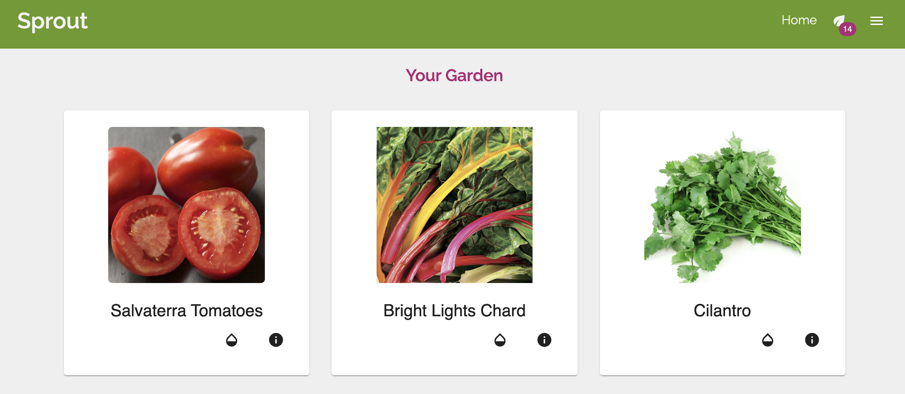
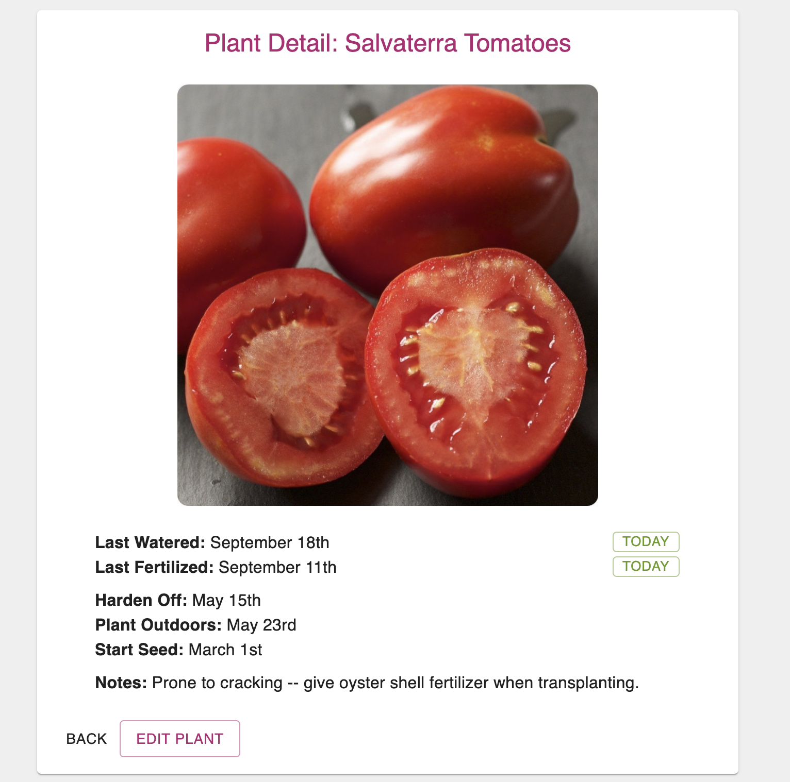
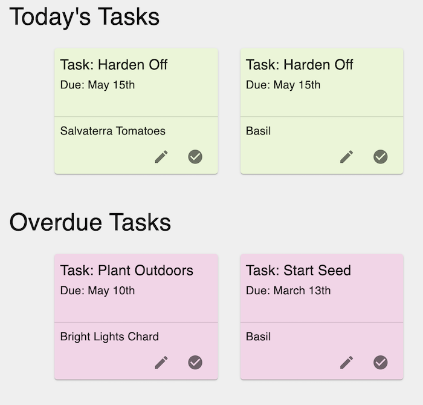

# Sprout

## Description

_Duration: Two Week Sprint_

Sprout is a task management application that helps gardeners grow bountiful vegetable plants from seed.

Sprout makes it easy to manage different timelines for each plant as you guide it through various stages, from starting seeds to caring for a new seedling to preparing it for the elements to finally planting it outdoors. Plan and track important milestones for each plant and easily view overdue and upcoming tasks.

## Screenshots

## Built With

* JavaScript
* Express
* React
* Redux
* Node.js
* Material-UI
* Moment.js
* SQL
* Passport.js
* AWS S3
* Dropzone S3 Uploader

## Getting Started

These instructions will get you a copy of the project up and running on your local machine for development and testing purposes.

### Prerequisites 

- [Node.js](https://nodejs.org/en/)
- [PostrgeSQL](https://www.postgresql.org/)
- [Nodemon](https://nodemon.io/)

### Installing

1. Create a databse named 'sprout'.
2. The queries in the `tables.sql` file are set up to create all the necessary tables and populate the needed data to allow the application to run correctly. The project is built on [Postgres](https://www.postgresql.org/download/), so you will need to make sure to have that installed. We recommend using Postico to run those queries as that was used to create the queries, 
3. Open up your editor of choice and run an `npm install`
4. Run `npm run server` in your terminal
5. Run `npm run client` in your terminal
6. The `npm run client` command will open up a new browser tab for you!

## Completed Features

- [x] Add plants to garden
- [x] Mark plant as watered or fertilized with one click
- [x] Notification badge to show incomplete/overdue tasks
- [x] Reschedule tasks or mark them as completed
- [x] Add notes to plant to track additional information
- [x] Upload images for each plant

## Next Steps
- [ ] Add calendar view for tasks
- [ ] Reschedule tasks by dragging event on calendar

## Author
* Jenni Schubert
